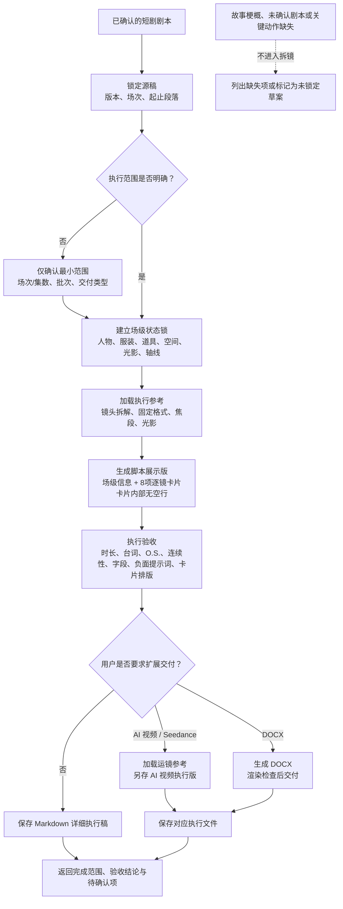

# Short Drama One-Click Storyboard 流程图

```mermaid
flowchart TD
    A["已确认的短剧剧本"] --> B["锁定源稿<br/>版本、场次、起止段落"]
    B --> C{"执行范围是否明确？"}
    C -- "否" --> D["仅确认最小范围<br/>场次/集数、批次、交付类型"]
    D --> E["建立场级状态锁<br/>人物、服装、道具、空间、光影、轴线"]
    C -- "是" --> E
    E --> F["加载执行参考<br/>镜头拆解、固定格式、焦段、光影"]
    F --> G["生成脚本展示版<br/>场级信息 + 8项逐镜卡片<br/>卡片内部无空行"]
    G --> H["执行验收<br/>时长、台词、O.S.、连续性、字段、负面提示词、卡片排版"]
    H --> I{"用户是否要求扩展交付？"}
    I -- "否" --> J["保存 Markdown 详细执行稿"]
    I -- "AI 视频 / Seedance" --> K["加载运镜参考<br/>另存 AI 视频执行版"]
    I -- "DOCX" --> L["生成 DOCX<br/>渲染检查后交付"]
    K --> M["保存对应执行文件"]
    L --> M
    J --> N["返回完成范围、验收结论与待确认项"]
    M --> N

    X["故事梗概、未确认剧本或关键动作缺失"] -. "不进入拆镜" .-> Y["列出缺失项或标记为未锁定草案"]
```

## 关键边界

- 只处理已确认剧本的逐镜头详细执行稿；不进行故事开发、分场大纲或标准剧本创作。
- 不新增、删改或重排人物关系、原台词、核心事件和结局。
- 默认交付脚本展示版；AI 视频执行版和 DOCX 仅在用户明确要求时生成。
